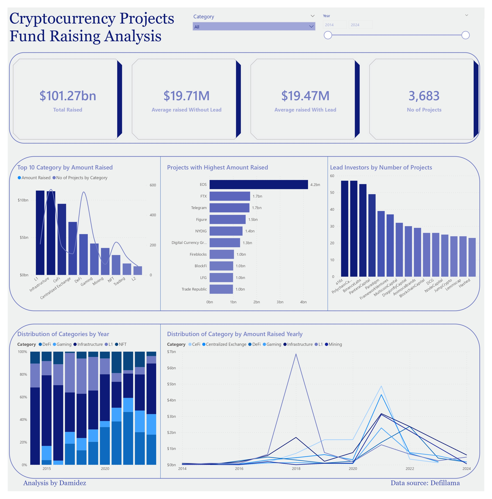
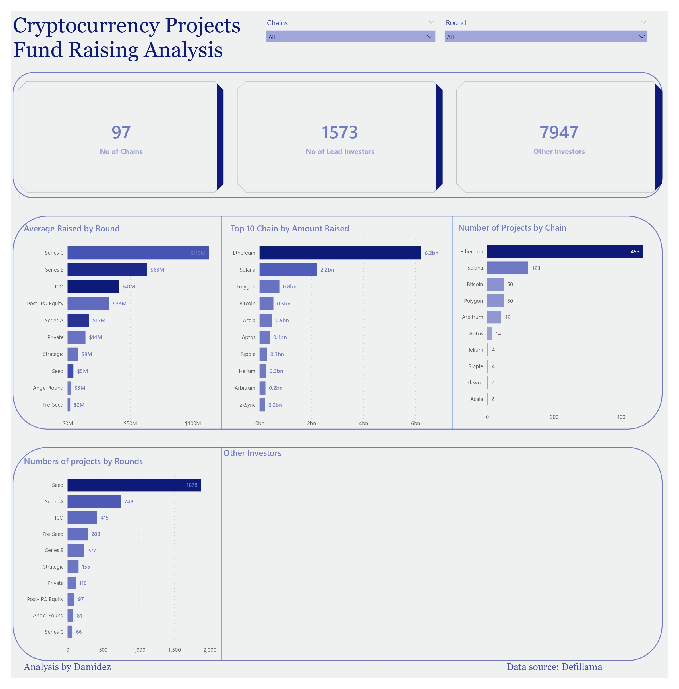

# Crypto-Project-Fund-Raising-Analysis

In the cryptocurrency industry, there is a widespread belief that DeFi represents the largest segment of the market and that most projects focus on this area. However, is this perception mirrored in investor behaviour?

I analyzed fundraising in cryptocurrency projects, and here are my findings:

Firstly, the dataset was sourced from **DefiLlama**, encompassing a total of 3,683 projects from 2014 to 29/04/2024.

## What is Cryptocurrency

A cryptocurrency is a digital, encrypted, and decentralized medium of exchange. There is no central authority that manages and maintains the value of a cryptocurrency. Instead, these tasks are broadly distributed among a cryptocurrency’s users via the internet.

## The Analysis
The total amount raised from 2014 to the present stands at $101.27 billion, with detailed figures available in the charts. The analysis reveals that investors primarily favoured Infrastructure projects before 2017, which is approximately two years after the Ethereum mainnet launch.

Investor interest shifted towards Layer 1 projects in 2017, and in 2018, a significant milestone occurred when EOS raised $4.2 billion. This event had a transformative impact on the crypto market, attracting more investors to the space and marking the highest fundraising year to date.

## Defi Fundraising Analysis

While DeFi is commonly perceived as the largest category within the crypto space, it's noteworthy that investors did not allocate significant investments to DeFi projects initially.

Investor participation in DeFi began in 2021, a year dominated by DeFi projects raising over a billion dollars. Notably, 2021 was a bullish market year, with projects like AAVE and XVS performing exceptionally well, which explains the increased investor interest in DeFi during that period.

Overall, from 2017 to 2021, investors showed more interest in gaming, CeFi (Centralized Finance), centralized exchanges, Layer 1 projects, and infrastructure compared to other project categories.

This analysis suggests that investors prioritize profit potential over market development.

## Investors Silent in Bear

Following the bullish market, the period from 2022 to the present has been challenging for the crypto space, impacting investor activity. Investors have been cautious about investing in new projects, and those who do invest tend to allocate smaller amounts due to market uncertainties.

For a more detailed trend analysis, please refer to the Trend Over Time chart.

Undoubtedly, Ethereum leads in fundraising, followed by Solana and Polygon. The top 10 chains can be viewed in the chart below.

## Seed Round

Furthermore, my analysis indicates that investors are hesitant to invest significant amounts in projects at very early stages, such as seed or pre-seed rounds. While there are more investors in the seed round, they tend to allocate more funds during the Series rounds.

In terms of specific projects, EOS holds the record for the crypto project with the highest fundraising at $4.2 billion, followed by FTX and Telegram, each raising $1.7 billion.

The dashboard contains additional analyses that provide further insights and are easily understandable.

Thank you for your attention.

